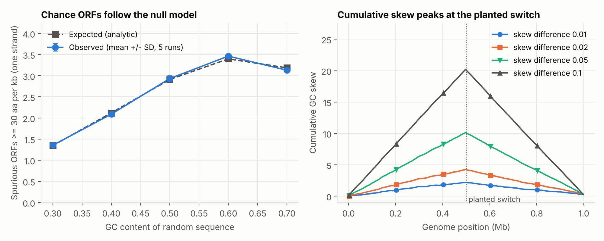

# orf-codon-toolkit

[](https://github.com/iraajgangavaram/orf-codon-toolkit/actions/workflows/tests.yml)

**Open reading frame (ORF) finding, codon usage (RSCU) and GC skew for
prokaryotic sequences, with every method checked against simulated sequences
whose true answer is known.**

The core is a small, dependency-free Python library plus a command-line tool
(`orfkit`). It is written to be read: each method is a few lines, documented,
unit-tested, and validated against an analytic null model and planted genes,
so you can see what it does and where it stops being reliable.

> **Headline results (all from simulation with known truth)**
> - On random sequence, the number of chance ORFs of 30 aa or more matches an
>   analytic renewal-process expectation to **within 2%** across GC contents of
>   30-70%.
> - **1,000 of 1,000** planted genes (5 runs x 200, both strands) were found with
>   the correct stop codon. **76.4%** also had the exact start; in the other
>   **23.6%** the reported start was an in-frame `ATG` upstream of the real one,
>   a known consequence of the first-`ATG` rule.
> - A cumulative GC-skew curve located a planted skew switch at 500 kb with a
>   median error of **2.5 kb** (half of a 5 kb window) at every skew strength
>   tested; the worst single error was 7.5 kb, at the weakest setting (a
>   1-percentage-point G/C difference).

## Contents

1. [Features](#features)
2. [Quick start](#quick-start)
3. [Method notes](#method-notes)
4. [Validation experiments](#validation-experiments)
5. [Testing](#testing)
6. [Limitations](#limitations)
7. [Repository layout](#repository-layout)
8. [References](#references)

## Features

| Command | What it does | Output (TSV to stdout) |
|---|---|---|
| `orfs` | ORFs on both strands, longest first, with protein sequence | record, strand, frame, start, end, length_aa, protein |
| `codons` | Relative synonymous codon usage per record | record, codon, rscu |
| `skew` | Windowed GC skew, optional step for sliding windows | record, window_start, gc_skew |
| `gc` | Length and GC content per record | record, length, gc_content |

The library has no dependencies (standard library only, Python 3.9+). Plots in
the validation section need `matplotlib`, which is an optional extra.

## Quick start

```bash
pip install -e ".[test]"          # add ",figures" to regenerate the validation plots

python -m orfkit orfs  examples/example.fa --min-aa 30   # ORFs, both strands
python -m orfkit codons cds.fa                           # RSCU per record
python -m orfkit skew  genome.fa --window 10000          # windowed GC skew
python -m orfkit gc    examples/example.fa               # GC content per record
```

Real output on the bundled demo (`examples/example.fa`, a synthetic 416 bp
sequence with two planted ORFs; protein truncated here for display):

```text
$ python -m orfkit orfs examples/example.fa --min-aa 30
record          strand  frame  start  end  length_aa  protein
synthetic_demo  +       2      41     223  60         MCWPSVNRLRVKVCIRLYLL...
synthetic_demo  +       3      249    386  45         MSVPSPVTECVRSIDYDALI...
synthetic_demo  -       3      166    261  31         MELTSALEFGRVGYKSEISE...

$ python -m orfkit gc examples/example.fa
record          length  gc_content
synthetic_demo  416     0.4928
```

The two `+` strand ORFs are the planted ones (60 and 45 codons). The `-` strand
ORF is a chance ORF in the random flanks, which is typical: a single sequence
always contains some. Output pipes cleanly into `head`, `sort`, `awk` or pandas.

Python API:

```python
from orfkit import find_orfs, codon_counts, rscu, gc_skew

orfs = find_orfs(seq, min_aa=30)          # list of ORF records, longest first
usage = rscu(codon_counts(cds))           # {codon: relative usage}
skew = gc_skew(genome, window=10_000)     # [(window_start, skew), ...]
```

## Method notes

- **ORFs** run from an `ATG` to the next in-frame stop codon (standard genetic
  code, table 1). Within a frame, each ORF starts at the first `ATG` after the
  previous stop, so nested ORFs are not reported separately and the reported
  protein is the longest possible one for that stop. ORFs that run off the end
  of the sequence without a stop codon are ignored.
- **Coordinates** are 1-based, inclusive, on the forward strand, and include
  the stop codon. For `-` strand ORFs, `start <= end` still holds and `frame`
  is numbered on the reverse complement.
- **RSCU** is observed count divided by the mean count of the synonymous codons
  for that amino acid, so 1.0 means no preference and a value above 1 means the
  codon is used more than expected under equal usage; amino acids never
  observed are omitted. Codons containing non-ACGT characters are skipped.
- **GC skew** is `(G - C) / (G + C)` per window (0 when a window has no G or C).
  In many bacteria, skew changes sign at the replication origin and terminus,
  so the cumulative skew curve has a maximum and a minimum there (Lobry 1996).
  Windows are labelled by their 1-based start position.
- **Null model for chance ORFs.** For base probabilities set by GC content, let
  `a` be the per-codon probability of `ATG` and `s` the probability of a stop
  codon. A scan cycle is a wait for an `ATG` (mean `1/a` codons) followed by a
  run to the next stop (mean `1/s` codons), so ORFs occur at rate
  `1 / (1/a + 1/s)` per codon per frame, and an ORF reaches `m` amino acids
  with probability `(1 - s)^(m - 1)`. This is the expectation compared with the
  scanner in experiment A.

## Validation experiments

All simulations are seeded; reproduce everything with
`python scripts/validate_orfs.py` (about 10 seconds).

### A. Chance ORFs versus the null model

Random sequences of 300 kb at five GC contents, forward strand, minimum 30 aa,
5 replicates each:

| GC content | Observed ORFs per kb (mean, SD) | Expected |
|---:|---:|---:|
| 0.30 | 1.354 (0.034) | 1.346 |
| 0.40 | 2.090 (0.016) | 2.121 |
| 0.50 | 2.934 (0.070) | 2.912 |
| 0.60 | 3.464 (0.033) | 3.398 |
| 0.70 | 3.130 (0.036) | 3.186 |

The largest deviation is 1.9%. The practical point is that **an ORF of 30 aa
is not evidence of a gene**: roughly 3 per kb arise by chance on one strand of
random 50%-GC sequence, which is why the minimum length matters and why ORFs
need support from other evidence.



### B. Recovering planted genes

200 random genes (50-500 codons, `ATG` first, random non-stop codons, random
stop) were planted on random strands in 200-600 bp of random 50%-GC background,
repeated 5 times (1,000 genes), and searched with `min_aa=40`:

| Outcome | Genes | Share |
|---|---:|---:|
| Found with exact start and end | 764 | 76.4% |
| Found with correct stop, start extended upstream | 236 | 23.6% |
| Not found | 0 | 0% |

Every planted gene is recovered, but a quarter have the wrong start. Because the
scanner begins at the first `ATG` after the previous stop, a chance in-frame
`ATG` in the preceding sequence extends the ORF. This is the usual
"longest ORF" convention and is why start positions from a plain ORF scan
should not be treated as gene start annotations. Each run also reports roughly
900-1,000 ORFs of 40 aa or more in total, almost all of them chance ORFs, so
recall here says nothing about precision on real genomes.

### C. Locating a GC-skew switch

1 Mb random genomes in which the first half is G-rich and the second half
C-rich by a stated difference in base probability; the cumulative skew (5 kb
windows) should peak at the switch (the 500 kb mark). 10 genomes per setting:

| G-C probability difference | Median absolute error | Maximum error |
|---:|---:|---:|
| 0.01 | 2,500 bp | 7,500 bp |
| 0.02 | 2,500 bp | 2,500 bp |
| 0.05 | 2,500 bp | 2,500 bp |
| 0.10 | 2,500 bp | 2,500 bp |

A 2,500 bp error is half a window, the resolution limit of 5 kb windows, so the
method is limited by window size rather than skew strength in this range. Real
genomes have weaker, patchier skew (genes, horizontal transfer), so this is
best-case behaviour.

## Testing

`pytest` runs 14 tests; CI runs them on Python 3.9, 3.11 and 3.12. They cover
translation and reverse complement, GC content and skew, ORF coordinates and
frame numbering on both strands (including reverse-strand mapping to forward
coordinates), nested start codons, unterminated ORFs and the minimum-length
filter, longest-first ordering, codon counting with ambiguous bases, RSCU values,
FASTA parsing errors, the CLI output format, and clean behaviour when output
is piped to `head`. The validation experiments above are scripts, not unit
tests.

## Limitations

- **Standard genetic code only.** No alternative start codons (`GTG`, `TTG`)
  and no alternative translation tables (for example mycoplasma, table 4).
- **Not a gene predictor.** A simple ORF scanner reports many spurious ORFs
  (experiment A) and uses the first-`ATG` rule (experiment B). Use a tool such
  as Prodigal (Hyatt et al. 2010) for annotation-grade gene calling.
- **Validated on simulated sequence.** The simulations use random background,
  independent bases and idealised planted genes. Real genomes have codon bias
  and dependence between neighbouring bases, so the numbers above are not
  predictions for real data, and no comparison against Prodigal or NCBI
  annotation has been made.
- No handling of circular genomes (ORFs spanning the origin are missed), and
  no support for gzipped FASTA.
- Pure Python: fine for bacterial genomes (megabases), slow for very large
  assemblies.

## Repository layout

```text
orfkit/            package: core (FASTA, ORFs, RSCU, GC skew) and cli
scripts/           validate_orfs.py (experiments A-C), _style.py
tests/             pytest suite (14 tests)
examples/          example.fa (synthetic demo sequence)
docs/figures/      validation figure
docs/results/      validation tables (CSV) and summary
.github/workflows/tests.yml
```

## References

- Hyatt D, Chen G-L, LoCascio PF, Land ML, Larimer FW, Hauser LJ (2010). Prodigal: prokaryotic gene recognition and translation initiation site identification. *BMC Bioinformatics* 11:119.
- Lobry JR (1996). Asymmetric substitution patterns in the two DNA strands of bacteria. *Molecular Biology and Evolution* 13:660-665.
- Sharp PM, Li W-H (1987). The codon adaptation index: a measure of directional synonymous codon usage bias, and its potential applications. *Nucleic Acids Research* 15:1281-1295.

## Author

Iraaj Gangavaram
